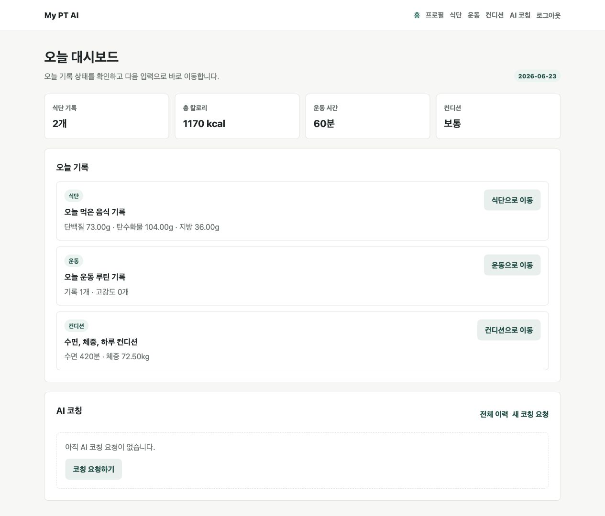
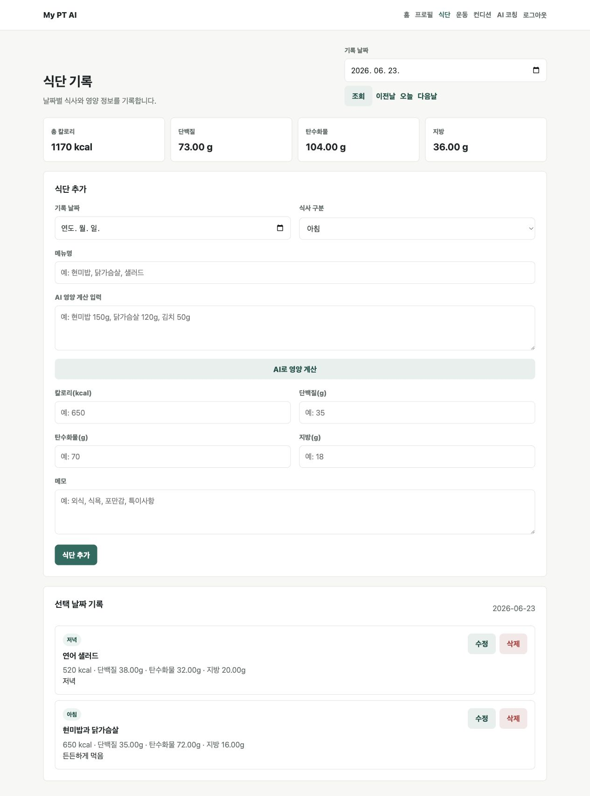
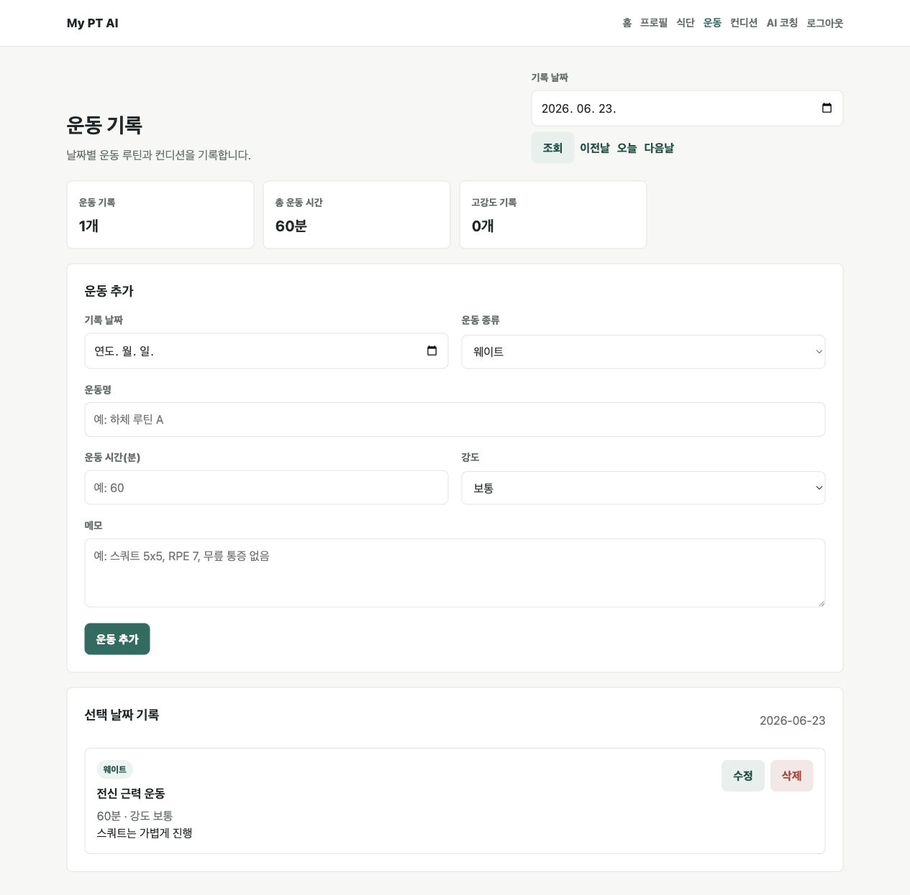
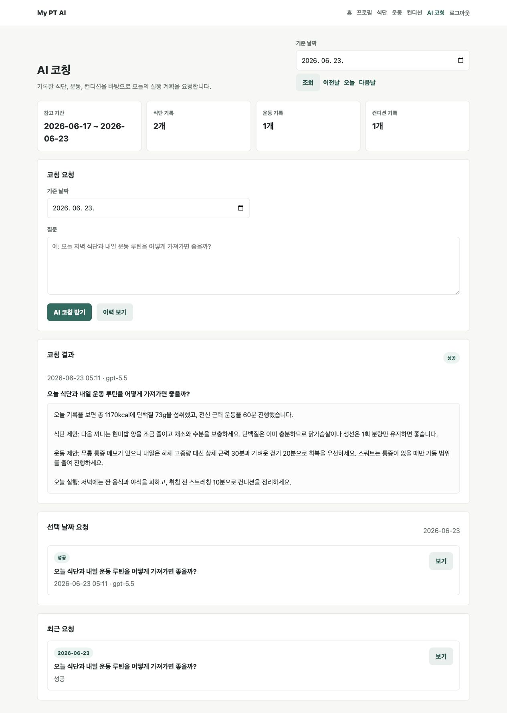

# My PT AI

[](https://github.com/geunnseung/myPtAi/actions/workflows/ci.yml)

식단과 운동 기록을 바탕으로 개인화된 AI 코칭을 제공하는 Spring Boot 웹앱입니다.

## 주요 기능 미리보기

아래 화면은 테스트 코드에서 사용하는 예시 데이터 흐름을 바탕으로 로컬에서 촬영했습니다. 예시 사용자는 `민수`이며, 2026년 6월 23일 기준으로 식단, 운동, 컨디션 기록을 입력한 상태입니다.

### 오늘 대시보드



### 식단 기록과 AI 영양 계산 입력



### 운동 루틴 기록



### 식단/운동 AI 코칭 답변



## 기술 스택

- Java 21
- Spring Boot 3.5.11
- Spring Web
- Spring Data JPA
- Bean Validation
- Thymeleaf
- Gradle
- H2 Database: 로컬 개발용
- MySQL: 운영용
- Flyway: 데이터베이스 마이그레이션 관리
- OpenAI API: 백엔드에서만 연동

## 로컬 실행

```bash
./gradlew bootRun
```

기본 프로필은 `local`이며 H2 인메모리 DB를 사용합니다. 별도 DB 설치 없이 `http://localhost:8080`에서 앱을 확인할 수 있습니다.

## Docker 실행

로컬에서 MySQL까지 함께 실행해 운영 프로필과 가까운 환경을 확인합니다.

```bash
cp .env.example .env
docker compose up --build
```

`.env` 파일에서 MySQL 비밀번호, `OPENAI_API_KEY`, 시간대, OpenAI 모델 값을 로컬 환경에 맞게 변경한 뒤 실행합니다.

헬스체크:

```bash
curl http://localhost:8080/actuator/health
```

종료:

```bash
docker compose down
```

MySQL 데이터까지 삭제:

```bash
docker compose down -v
```

이미지만 빌드:

```bash
docker build -t my-pt-ai .
```

## 운영 환경변수

`prod` 프로필은 외부 MySQL과 OpenAI API 키를 환경변수로 주입받습니다.

| 이름 | 설명 | 예시 |
| --- | --- | --- |
| `MYSQL_URL` | MySQL JDBC URL | `jdbc:mysql://localhost:3306/myptai?serverTimezone=Asia/Seoul&characterEncoding=UTF-8` |
| `MYSQL_USERNAME` | MySQL 사용자명 | `myptai` |
| `MYSQL_PASSWORD` | MySQL 비밀번호 | `change-me` |
| `OPENAI_API_KEY` | OpenAI API 키 | `sk-...` |
| `OPENAI_BASE_URL` | OpenAI API base URL | `https://api.openai.com/v1` |
| `OPENAI_MODEL` | AI 코칭에 사용할 모델 | `gpt-5.5` |
| `OPENAI_CONNECT_TIMEOUT` | OpenAI 연결 타임아웃 | `3s` |
| `OPENAI_READ_TIMEOUT` | OpenAI 응답 대기 타임아웃 | `30s` |
| `MYPTAI_TIME_ZONE` | 앱의 날짜 기준 시간대 | `Asia/Seoul` |

운영 프로필을 직접 실행할 때는 다음처럼 필요한 값을 주입합니다.

```bash
SPRING_PROFILES_ACTIVE=prod \
MYSQL_URL='jdbc:mysql://localhost:3306/myptai?serverTimezone=Asia/Seoul&characterEncoding=UTF-8' \
MYSQL_USERNAME=myptai \
MYSQL_PASSWORD=change-me \
OPENAI_API_KEY=sk-your-key \
./gradlew bootRun
```

현재 프로젝트는 실무 커밋 단위로 작게 쌓아갑니다.

## CI

GitHub Actions에서 `main`, `codex/**` 브랜치 푸쉬와 `main` 대상 PR마다 테스트를 실행합니다.

## 문서

- [MVP 요구사항](docs/mvp-requirements.md)
- [도메인 모델](docs/domain-model.md)
