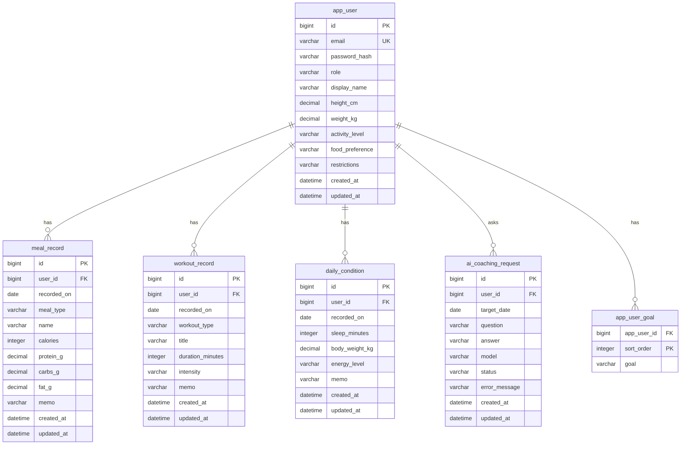

# 도메인 모델

## 설계 원칙

- 데이터베이스 스키마는 Flyway로 명시적으로 버전 관리합니다.
- JPA Entity는 영속성 모델입니다. 요청이나 응답 객체로 직접 사용하지 않습니다.
- Thymeleaf 폼은 Entity가 아니라 DTO를 사용합니다.
- 트랜잭션 경계는 Service 계층에서 정의합니다.
- Controller는 얇게 유지하고, 비즈니스 규칙은 Service에 위임합니다.
- MVP에서는 단순성을 위해 `BIGINT AUTO_INCREMENT` 대리키를 사용합니다.
- 테이블과 컬럼은 `snake_case`, Java 클래스와 필드는 `camelCase`를 사용합니다.

## Entity 개요



## 테이블

### app_user

가입 사용자와 사용자 프로필을 함께 나타냅니다. 인증 정보와 코칭에 필요한 프로필 정보를 같은 사용자 루트에 두고, 식단/운동/컨디션/AI 코칭 기록은 모두 `app_user`를 기준으로 분리합니다.

| 컬럼 | 타입 | 필수 | 설명 |
| --- | --- | --- | --- |
| id | BIGINT | 예 | 기본키 |
| email | VARCHAR(255) | 아니오 | 로그인 이메일, 가입 사용자는 유니크 |
| password_hash | VARCHAR(100) | 아니오 | 해시된 비밀번호 |
| role | VARCHAR(30) | 예 | USER |
| display_name | VARCHAR(50) | 예 | 화면에 표시할 사용자 이름 |
| height_cm | DECIMAL(4,1) | 아니오 | 키, 단위는 cm |
| weight_kg | DECIMAL(5,2) | 아니오 | 프로필 기준 체중 |
| activity_level | VARCHAR(30) | 아니오 | LOW, MODERATE, HIGH |
| food_preference | VARCHAR(500) | 아니오 | 선호 식단 자유 입력 |
| restrictions | VARCHAR(500) | 아니오 | 음식 제한, 일정, 부상 관련 메모 |
| created_at | DATETIME(6) | 예 | 생성 시각 |
| updated_at | DATETIME(6) | 예 | 마지막 수정 시각 |

### app_user_goal

사용자 프로필의 목표 목록을 저장합니다. 목표는 사용자가 여러 개 선택할 수 있으므로 `app_user` 컬럼에 문자열로 합치지 않고 별도 테이블로 분리합니다.

| 컬럼 | 타입 | 필수 | 설명 |
| --- | --- | --- | --- |
| app_user_id | BIGINT | 예 | `app_user` 외래키 |
| sort_order | INT | 예 | 목표 표시 순서 |
| goal | VARCHAR(50) | 예 | FAT_LOSS, MUSCLE_GAIN, MAINTENANCE, HEALTH |

### meal_record

식단 기록 1개를 저장합니다. 같은 사용자와 같은 날짜에 여러 개의 식단 기록이 존재할 수 있습니다.

| 컬럼 | 타입 | 필수 | 설명 |
| --- | --- | --- | --- |
| id | BIGINT | 예 | 기본키 |
| user_id | BIGINT | 예 | `app_user` 외래키 |
| recorded_on | DATE | 예 | 식단 기록 날짜 |
| meal_type | VARCHAR(30) | 예 | BREAKFAST, LUNCH, DINNER, SNACK |
| name | VARCHAR(100) | 예 | 메뉴명 |
| calories | INT | 아니오 | 칼로리, 단위는 kcal |
| protein_g | DECIMAL(6,2) | 아니오 | 단백질, 단위는 g |
| carbs_g | DECIMAL(6,2) | 아니오 | 탄수화물, 단위는 g |
| fat_g | DECIMAL(6,2) | 아니오 | 지방, 단위는 g |
| memo | VARCHAR(500) | 아니오 | 자유 메모 |
| created_at | DATETIME(6) | 예 | 생성 시각 |
| updated_at | DATETIME(6) | 예 | 마지막 수정 시각 |

### workout_record

운동 기록 1개를 저장합니다. 같은 사용자와 같은 날짜에 여러 개의 운동 기록이 존재할 수 있습니다.

| 컬럼 | 타입 | 필수 | 설명 |
| --- | --- | --- | --- |
| id | BIGINT | 예 | 기본키 |
| user_id | BIGINT | 예 | `app_user` 외래키 |
| recorded_on | DATE | 예 | 운동 기록 날짜 |
| workout_type | VARCHAR(30) | 예 | STRENGTH, CARDIO, MOBILITY, REST |
| title | VARCHAR(100) | 예 | 운동명 |
| duration_minutes | INT | 아니오 | 총 운동 시간, 단위는 분 |
| intensity | VARCHAR(30) | 아니오 | EASY, NORMAL, HARD, VERY_HARD |
| memo | VARCHAR(1000) | 아니오 | 세트, 반복 횟수, 통증, 컨디션 메모 |
| created_at | DATETIME(6) | 예 | 생성 시각 |
| updated_at | DATETIME(6) | 예 | 마지막 수정 시각 |

### daily_condition

날짜별 하루 컨디션을 저장합니다. 사용자 1명과 날짜 1개 조합에는 컨디션 기록이 1개만 존재합니다.

| 컬럼 | 타입 | 필수 | 설명 |
| --- | --- | --- | --- |
| id | BIGINT | 예 | 기본키 |
| user_id | BIGINT | 예 | `app_user` 외래키 |
| recorded_on | DATE | 예 | 컨디션 기록 날짜 |
| sleep_minutes | INT | 아니오 | 수면 시간, 단위는 분 |
| body_weight_kg | DECIMAL(5,2) | 아니오 | 당일 체중 |
| energy_level | VARCHAR(30) | 아니오 | GOOD, NORMAL, TIRED, EXHAUSTED |
| memo | VARCHAR(1000) | 아니오 | 자유 메모 |
| created_at | DATETIME(6) | 예 | 생성 시각 |
| updated_at | DATETIME(6) | 예 | 마지막 수정 시각 |

### ai_coaching_request

사용자 질문과 AI 답변을 저장합니다. 나중에 답변 이력 확인, 장애 분석, 프롬프트 개선에 사용할 수 있습니다.

| 컬럼 | 타입 | 필수 | 설명 |
| --- | --- | --- | --- |
| id | BIGINT | 예 | 기본키 |
| user_id | BIGINT | 예 | `app_user` 외래키 |
| target_date | DATE | 예 | 코칭 기준 날짜 |
| question | VARCHAR(1000) | 예 | 사용자 질문 |
| answer | VARCHAR(10000) | 아니오 | AI 답변 |
| model | VARCHAR(100) | 아니오 | OpenAI 모델명 |
| status | VARCHAR(30) | 예 | REQUESTED, SUCCEEDED, FAILED |
| error_message | VARCHAR(1000) | 아니오 | API 실패 사유 |
| created_at | DATETIME(6) | 예 | 생성 시각 |
| updated_at | DATETIME(6) | 예 | 마지막 수정 시각 |

## 인덱스와 제약조건

- 날짜별 식단 조회를 위해 `meal_record(user_id, recorded_on)` 인덱스를 둡니다.
- 날짜별 운동 조회를 위해 `workout_record(user_id, recorded_on)` 인덱스를 둡니다.
- 날짜별 컨디션은 1개만 존재해야 하므로 `daily_condition(user_id, recorded_on)`에 유니크 제약조건을 둡니다.
- 코칭 이력 조회를 위해 `ai_coaching_request(user_id, target_date, created_at)` 인덱스를 둡니다.
- 이메일 중복 가입을 막기 위해 `app_user(email)` 유니크 인덱스를 둡니다.
- MVP에서는 실수로 프로필을 삭제해 기록이 함께 사라지는 일을 막기 위해 외래키 삭제 정책은 `ON DELETE RESTRICT`로 둡니다.

## 현재 패키지 구조

```text
com.myptai
  MyPtAiApplication
  global
    domain
    security
    time
    web
  auth
    application
    web
  user
    domain
    application
    repository
    web
  meal
    domain
    application
    repository
    web
  workout
    domain
    application
    repository
    web
  condition
    domain
    application
    repository
    web
  coaching
    domain
    application
    infrastructure
      openai
    repository
    web
```

## 이름 규칙

- Entity: `MealRecord`, `WorkoutRecord`, `DailyCondition`, `AiCoachingRequest`
- Repository: `MealRecordRepository`
- Service: `MealRecordService`
- Form DTO: `MealRecordForm`, `WorkoutRecordForm`, `DailyConditionForm`
- Controller: `MealRecordController`
- Thymeleaf template: `meal/list.html`, `meal/form.html`
